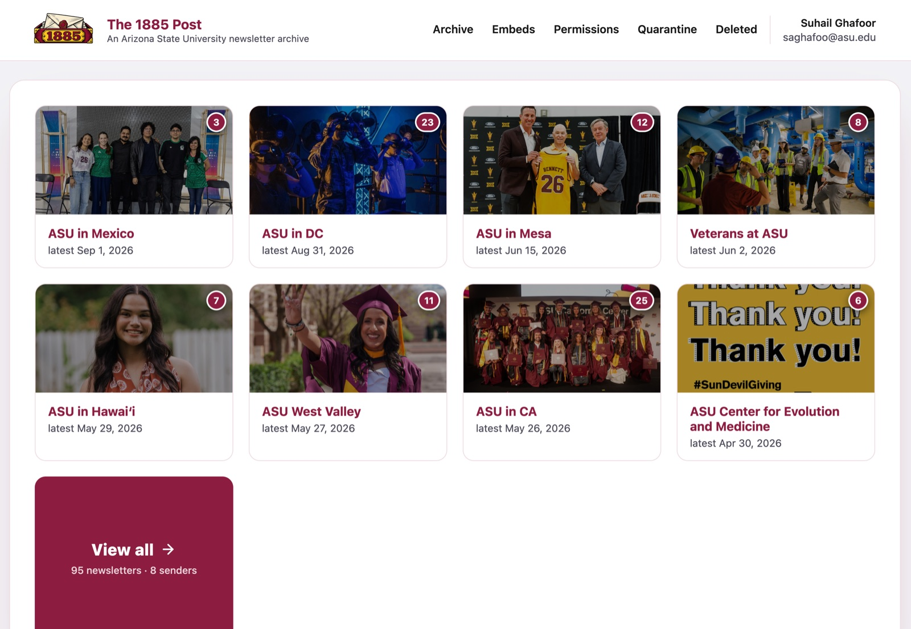

# The 1885 Post

**A university-wide, permanent archive for ASU newsletters.** Send a newsletter to one
address and it shows up automatically, forever, at a linkable URL -- no more digging
through inboxes or losing old issues when a mailing platform's account lapses.



## What it does

- **Zero-effort ingestion.** Send (or CC/BCC) a newsletter to a single address and it's
  live on the site within moments -- no upload, no manual step.
- **A homepage organized by sender**, each with a thumbnail, a running newsletter
  count, and a link to every past issue from that sender.
- **A full, searchable archive** -- filter by sender, sort oldest/newest, paginated.
- **Permanent links and print-ready pages** for every newsletter, including a
  one-click "Print / Save as PDF" view and preview cards when a link is shared in
  Slack, iMessage, etc.
- **Content that survives the original sender.** Click-tracking links are resolved to
  their real destination and external images are mirrored into permanent storage, so
  an archived newsletter still renders correctly even after the sending platform
  deletes or expires the originals. Unsubscribe links are neutralized so the public
  archive can never be used to unsubscribe someone.
- **Embeddable widgets** -- publish a "recent newsletters" iframe for any sender (or
  all of them) on a department website in a couple of clicks.
- **Granular permissions** -- per-sender admin grants let specific people manage
  specific senders' newsletters, without needing full admin access to the whole site.
- **Sender quarantine.** Only `*.asu.edu` senders (any subdomain) show up by default;
  anything else is held in a review queue instead of the public site until a super
  admin whitelists it -- nothing is ever silently rejected or dropped, so mail
  delivery stays diagnosable.

## How it works

The whole thing is a single Cloudflare Python Worker. Cloudflare Email Routing
delivers incoming mail directly to the Worker (no separate relay); that same Worker
parses and sanitizes the email, stores it in D1 (Cloudflare's SQL database), mirrors
images into R2 (object storage), and serves every page of the site, including the
public embeds.

The deployed instance is Cloudflare Access-gated for ASU colleagues -- see
[USAGE.md](USAGE.md) for how colleagues use it.

The rest of this README is for developing/deploying the code. See
[ARCHITECTURE.md](ARCHITECTURE.md) for how the code is organized and how requests flow
through it.

## Local development

Local dev and the deployed Worker **share one D1 database** (`d1_databases[0].remote:
true` in `wrangler.jsonc`) — there's no separate local-only copy to fall out of sync.
Ingesting a real email in production is immediately visible to (and re-testable by) a
locally-run, possibly-newer version of this code, and vice versa.

```bash
uv sync --extra dev              # sqlite3-backed pytest suite (parser/sanitizer/slug logic)
uv run pytest

npm install -g wrangler@latest   # pywrangler proxies to this; needs >=4.109.0 for Python Workers.
                                  # Deliberately global, not a project-local node_modules/ -- see
                                  # the bundle-size note below.
uv run pywrangler dev            # real Worker runtime, bound to the SAME remote D1 as production
```

With `pywrangler dev` running (defaults to `http://localhost:8787`):

```bash
curl -X POST "http://localhost:8787/ingest?to=newsletter-archive@example.com" \
  --data-binary @tests/fixtures/mailchimp_style.eml \
  -H "Content-Type: message/rfc822"
```

then open the printed `/n/{slug}` URL, or `http://localhost:8787/` for the homepage --
this write is real and immediately visible at the production URL too. Re-posting the
same email (same `Message-ID`) is a no-op — it returns the existing entry instead of
erroring, since Email Routing retries and other push sources can redeliver.

Set `NEWSLETTER_ARCHIVE_INGEST_TOKEN` (checked against an `X-Ingest-Token` header on
`POST /ingest`) before this Worker is reachable by anything other than you.

## Deploying

```bash
# First time, or after pulling schema changes: run any migrations/*.sql not yet applied
# to the remote DB, in order (no migration-tracking table yet -- check by hand).
uv run pywrangler d1 execute DB --remote --file migrations/0001_init.sql
uv run pywrangler deploy
```

Still to do: in the Cloudflare dashboard (or via `wrangler email routing rules create`),
route an inbound address to this Worker. See `wrangler email routing --help`.

## What gets changed vs. preserved

Only unsubscribe / manage-preferences / email-preferences links (matched by anchor text
and known href patterns, see `sanitizer.py`) get their `href` attribute removed entirely
-- not set to `#`, which is still a real (if inert-looking) navigation target. Every
other link's destination is left exactly as it was in the original email, except that
tracked/redirect links (e.g. click-tracking wrappers) are rewritten to the real
destination URL they resolve to (see `worker_entry.py`) -- the visible link text is
unchanged, only where it actually goes. Every remaining link's `target`/`rel` is
normalized to always open in a new tab (`force_links_new_tab` in `sanitizer.py`), since
the newsletter body renders inside a sandboxed iframe and a link without that would
either silently fail to open or navigate the iframe in place. Inline (`cid:`) images
are extracted and re-served from the archive so permalinks don't show broken images;
externally-hosted images are downloaded once and mirrored into R2 so the archive
doesn't depend on the original host staying up.
